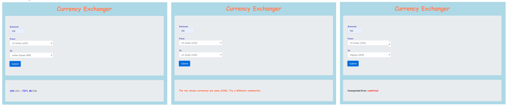

# Currency Exchanger

##### Date: **02/12/2021**

#### By **_Salim Mayan_**

## Description

##### A web application where a user can type in an amount, choose FROM and TO currencies from the drop down, and see total amount in converted currency. The currency conversion is performed using the most recent exchange rate from ExchangeRate-API. Few other things that the application does is listed below...

- User should be able to convert between 160 different types of currencies.
- If the API call results in an error, the application returns a notification
- If the query response doesn't include a particular currency, the application returns a notification that states the currency in question doesn't exist
- If both FROM and TO currencies are identical, application displays an error message
- See below image of UI for the different scenario's described above


| **Spec** |

```

| Test | Behavior | Input    | Output   |
| -------- | -------- | -------- | -------- |
| 1 | Application lets user type in an amount, choose FROM and TO currencies from the drop down, and see total amount in converted currency | USD: $100.00; Currency: Indian Rupee (INR) | 7271.48 INR |
| 2 | Application accepts 160 different currencies. | USD: $100.00; Currencies: Afghani (AFN), Algerian Dinar (DZD), Euro (EUR), Saudi Riyal (SAR), Russian Ruble (RUB), Mexican Peso (MXN) | 7721.36 AFN, 13299.81 DZD, 82.45 EUR, 375 SAR, 7400.98 RUB, 2000.06 MXN |
| 3 | The program displays API call failures | * Insert a typo in API KEY* | Unexpected error: undefined |
| 4 | If currency conversion is sought for a currency not supported by API, application returns a notification, stating the currency is NOT supported | FED | non-existant currency (FED) is NOT supported  |

```
## Setup/Installation Requirements

1. Clone this repository.
2. To download node modules, run `npm install`
3. Create an '.env' FILE in your project root directory.
    * Register for free API key: Visit: https://www.exchangerate-api.com/  & enter register yourself to get a free key.
    * Once registration is complete, log in using the new credentials, add API key in .env file using syntax: "API_KEY=[Your API KEY]" (No double quotes and No brackets)
    * Add .env to .gitignore
4. To do a build and run application on a dev server, run 	`npm run start`

## Known Bugs


* No known bugs at this time.

## Technologies Used

* HTML

* CSS

* Bootstrap

* JS

* JQuery

* Jest

* Webpack

* Node

* npm

* Markdown

* Exchange Rate API


## Support and contact details


_Email no one with any questions, comments, or concerns._


### License


*{This software is licensed under the MIT license}*


Copyright (c) 2021 **_{Salim Mayan}_**